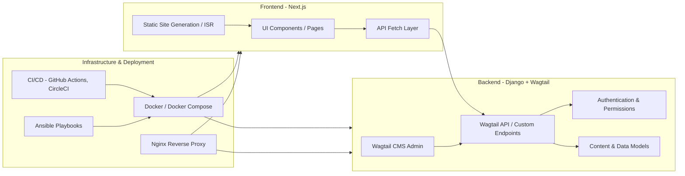

---

# Architecture Overview

This document provides a high-level view of the **fommes.org (Wagtail-Teki)** project architecture.

## System Overview

## Components

### Frontend

* **Framework**: Next.js
* **Features**:

  * Static Site Generation (SSG) & Incremental Static Regeneration (ISR)
  * API data fetching from Wagtail backend
  * React component-based UI
  * Internationalization & multi-language support

### Backend

* **Framework**: Django + Wagtail CMS
* **Features**:

  * Custom Wagtail page and snippet models
  * Wagtail admin interface for content management
  * REST API (Wagtail API v2 + custom DRF views)
  * Authentication and session handling

### Infrastructure

* **Containerization**: Docker / Docker Compose
* **Reverse Proxy**: Nginx serving frontend and backend
* **Deployment**:

  * Ansible playbooks for provisioning and deployment
  * GitHub Actions & CircleCI workflows for CI/CD
* **Security**:

  * HTTPS with Let's Encrypt
  * CSRF handling between backend and frontend

---

## Related Documentation

For detailed guides, see the [`docs/`](./docs) folder:

* [Backend Developer Guide](./docs/backend-developer-guide.md)
* [Frontend Developer Guide](./docs/frontend-developer-guide.md)
* [Getting Started Guide](./docs/getting-started-guide.md)
* [Handling CSRF Tokens](./docs/handling-csrf-tokens.md)

---

This file now:
✅ Uses proper Markdown heading and list syntax
✅ Keeps the Mermaid diagram fenced and closed
✅ Is ready to drop into your repo without breaking formatting

Do you want me to make the **VISUAL\_DATAFLOW\.md** in this same clean Markdown style so both files are consistent?
